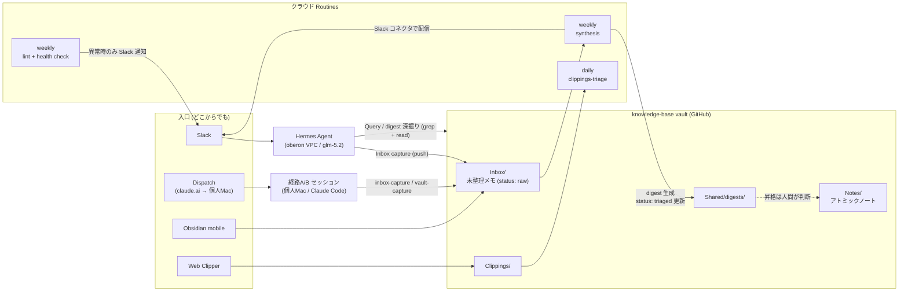
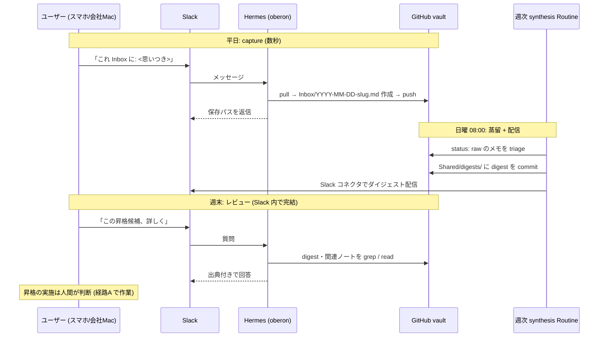

# Mnemos Inbox 層 + リモート入口/出口 (Hermes / Routine) 導入計画

> **For agentic workers:** REQUIRED SUB-SKILL: Use superpowers:subagent-driven-development (recommended) or superpowers:executing-plans to implement this plan task-by-task. Steps use checkbox (`- [ ]`) syntax for tracking.

**Goal:** 個人 Mac のセッション内にしか存在しない Mnemos の「入口」と「出口」を、どこからでも(スマホ・会社 Mac・移動中)使えるようにする。

**Architecture:** vault root に `Inbox/`(思考の作業場)を新設し、入口を複数化する。主入口は **VPC (oberon) 上の Hermes Agent(Slack 経由・個人 Mac 非依存)**、副入口は Dispatch(個人 Mac 上のセッションをリモート起動、追加実装ゼロ)。出口は週次のクラウド Routine が Inbox を蒸留してダイジェストを生成し、**Routine の Slack コネクタで直接配信**する。単発の Query とダイジェストの深掘りは Slack 上の Hermes が担う。weekly-lint には health check(「静かに壊れる」検知)を統合する。

**Tech Stack:** Obsidian vault (git)、Hermes Agent (NousResearch, oberon NixOS + Slack + glm-5.2)、Claude Code Routine(クラウド + Slack コネクタ)、vault 側 skill、dotfiles 側 skill(enquire-mcp 経由)。

---

## 全体像





---

## 背景・設計判断

### 解決する問題

2026-06-28 の Mnemos 稼働開始から 1 週間で capture ゼロだった。原因は 2 つ:

1. インフラが静かに壊れていた(native install PATH shadow → 修正済み、2026-07-05)
2. **知見が最も発生する時間帯(平日・会社 Mac・移動中)に vault への入口が存在しない**

また、既存のファイル化基準(2 ソース統合・固有名詞など)は「結論」用であり、
**まだ結論でない思いつき・生煮えの思考の置き場がない**。

### 入口の比較と採用判断

前提: Dispatch はクラウド実行ではなく、**個人 Mac 上のローカルセッションを
リモートから起動する仕組み**(Mac 起動 + Claude アプリが開いていることが必要)。

| 観点 | Dispatch | Discord 連携 | Hermes (Slack)(主入口に採用) |
|---|---|---|---|
| 実行場所 | 個人 Mac(リモート起動) | 個人 Mac(常駐セッション) | **oberon (VPC)・Mac 非依存** |
| 障害モード | Mac スリープ/アプリ終了 | Mac スリープ/セッション終了 | systemd 管理・自動再起動 |
| 1 メモの摩擦 | 中(アプリ→リポジトリ→プロンプト) | 低(チャット一行) | **低(Slack に一行)** |
| 追加実装 | ゼロ(vault 規約だけで動く) | bot token・access 管理 | deploy key + instruction 追記 |
| モデル | Claude | Claude | glm-5.2(open model) |

**採用**: Hermes を主入口、Dispatch を副入口(追加実装ゼロなので併存)、Discord は不採用。

- Hermes は Mnemos 設計時から予約されていた第 3 エージェント枠(`Agents/Hermes-Agent/`)の実現でもある
- glm-5.2 の指示追従性を考慮し、Hermes に渡す規約は**単純に保つ**(1 ファイル作成 + push のみ、
  書き込みは `Inbox/` 限定)。git 履歴が安全網になるため直 push で開始する
- Mac mini はデスクトップなので、スリープ無効 + Claude アプリ常時起動にすれば Dispatch も実用になる

### 出口: 週次 synthesis + Slack 配信 + Hermes 深掘り

- 蒸留(Inbox → Notes 昇格提案)とダイジェスト(今週の追加・休眠ノート再サーフェス)は
  読者・タイミングが同じなので 1 つのクラウド Routine に統合する
- **配信は Routine の Slack コネクタで直接行う**(digest 生成と同一実行内で送信するため
  取りこぼしがなく、追加インフラ不要)。コネクタが Routine 実行環境で使えない場合の
  フォールバックは vault リポジトリの GitHub Actions(digests への push をトリガーに webhook 通知)
- ダイジェストの深掘り・単発の Query は Slack 上の Hermes が担う(clone 済み vault を
  grep して出典付き回答)。**Slack が vault のフロントエンドになる**
- 設計原則: **生成系 Routine の出力は「Slack に届く」か「PR として人間のレビューに乗る」かの
  どちらかに必ず接続する**。commit されるだけのレポートは読まれず、複利にならない

### health check の統合(「静かに壊れる」対策)

稼働 1 週目の失敗(PATH shadow による MCP 停止、weekly-lint の実行痕跡なし)を踏まえ、
weekly-lint Routine に Mnemos 自体の健全性検査を統合する:

- daily triage / synthesis の commit が期待通り積まれているか
- `Inbox/` に `status: raw` が溜まりすぎていないか(閾値: 20 件)
- `log.md` が更新されているか

異常時**のみ** Slack コネクタで警告を送る(正常時は通知しない。通知疲れを避ける)。

### Inbox 層の位置づけ

- Layer 2(The wiki)内の**作業場サブレイヤ**。既存のファイル化基準を満たさなくても書いてよい唯一の場所
- **1 思考 1 ファイル**(`Inbox/YYYY-MM-DD-<slug>.md`)。複数ライター(Hermes・Routine・ローカル・モバイル)間の git 衝突を避ける。同一ファイルへの追記は同一セッション内のみ
- Routine は frontmatter の `status` 更新まで。`Notes/` への昇格判断は人間(既存の append-only 原則を維持)
- 方向性B(思考の作業場レイヤ)はこの Inbox に統合する

### 経路の再定義

| 経路 | 実体 | ツール |
|---|---|---|
| A | vault 内 Claude Code(個人 Mac) | Grep/Glob/Read/Edit/Write 直接 |
| B | 別プロジェクトから MCP 経由(個人 Mac) | enquire-mcp |
| **C(新設)** | **リモートエージェント: クラウド Routine + oberon の Hermes** | git clone + Grep/ファイル直接操作。enquire-mcp なし |

Dispatch で起動されたセッションは個人 Mac 上の経路A/B に過ぎないため特別扱いしない
(vault 規約と skill がそのまま効く)。

### 用語衝突の解消

既存 Routine `vault-daily-inbox-triage` は Clippings の triage であり、新しい `Inbox/` と紛らわしい。
`vault-daily-clippings-triage` にリネームする。

---

## Task 1: vault に Inbox/ を新設し CLAUDE.md に規約を追加

**Files:**
- Create: `~/src/github.com/thinceller/knowledge-base/Inbox/.gitkeep`
- Modify: `~/src/github.com/thinceller/knowledge-base/CLAUDE.md`

- [ ] **Step 1: Inbox/ ディレクトリを作成**

```bash
mkdir -p ~/src/github.com/thinceller/knowledge-base/Inbox
touch ~/src/github.com/thinceller/knowledge-base/Inbox/.gitkeep
```

- [ ] **Step 2: CLAUDE.md のディレクトリ構成を更新**

`## ディレクトリ構成` のコードブロックに `Inbox/` を追加:

```
./ (vault root = git root)
├── Notes/          # ナレッジベース（1ページ1トピック、双方向リンク）
├── Inbox/          # 思考の作業場（未整理の思いつき・アイデア。週次 Routine が triage）
├── Clippings/      # Web Clipper で保存したページ
└── .obsidian/      # Obsidian 設定（git 管理対象、workspace.json は除外）
```

- [ ] **Step 3: CLAUDE.md に Inbox セクションを追加**

`## Clippings/` セクションの後に以下を挿入:

```markdown
## Inbox/（思考の作業場）

まだ結論でない思いつき・アイデア・生煮えの思考の受け皿。
ファイル化基準（2 ソース統合・固有名詞など）を**満たさなくても書いてよい唯一の場所**。

- **1 思考 1 ファイル**: `Inbox/YYYY-MM-DD-<slug>.md`（slug は内容を表す短い英数字ケバブケース）。
  複数ライター（Hermes・Routine・ローカル・モバイル）間の git 衝突を避けるため、
  既存ファイルへの追記は同一セッション内のみ
- **frontmatter**:
  ```yaml
  type: inbox
  created: 'YYYY-MM-DDTHH:MM:SS+09:00'
  source: hermes | dispatch | session | mobile
  status: raw | triaged
  ```
- **書き込み**: どの経路からでも可。「これ Inbox に」「メモっておいて（未整理）」で
  `inbox-capture` スキル（経路A）または `vault-capture` スキル（経路B）が反応する。
  Slack の Hermes 宛メッセージも同じ規約で `Inbox/` に書く（source: hermes）
- **triage**: 週次 synthesis Routine が `status: raw` のメモを読み、`Notes/` 昇格候補を
  `Shared/digests/` に提案して `status: triaged` に更新する。**昇格・削除の判断は人間**
- **lint 対象外**: Inbox のメモは orphan / thin note 扱いしない（未整理であることが正常）
- `log.md` への追記は不要（高頻度・軽量のためノイズになる）
```

- [ ] **Step 4: CLAUDE.md のアクセス経路に経路C を追加**

`### 経路Bの場合` セクションの後に以下を挿入:

```markdown
### 経路Cの場合（リモートエージェント: クラウド Routine / oberon の Hermes Agent）

- 個人 Mac の外で動くエージェント。git clone した vault に対し
  **Grep / Glob / Read / Edit / Write + git** で操作する（経路A のリモート版）
- enquire-mcp は使えない。検索は Grep/Glob で行う
- **Inbox capture**: 「これ Inbox に」等の指示を受けたら `Inbox/` 規約に従い
  ファイルを 1 つ作成して commit & push する（`Inbox/` 以外への書き込みはしない）
- **Query**: vault への質問も可能。関連ページを Grep で探し出典付きで回答する
- push 前に必ず pull --rebase し、push 失敗時に force push はしない
```

- [ ] **Step 5: vault-lint スキルの除外設定を確認**

`.claude/skills/vault-lint/SKILL.md` を Read で確認し、対象ディレクトリの列挙があれば
`Inbox/` を lint 対象外として追記する(なければ何もしない。CLAUDE.md の記述が規約として効く)。

- [ ] **Step 6: Commit & push**

```bash
cd ~/src/github.com/thinceller/knowledge-base
git pull --rebase
git add Inbox/.gitkeep CLAUDE.md
git commit -m "feat: Inbox/ 層を新設 (思考の作業場) + 経路C (リモートエージェント) を定義"
git push
```

---

## Task 2: vault 側に inbox-capture スキルを作成

**Files:**
- Create: `~/src/github.com/thinceller/knowledge-base/.claude/skills/inbox-capture/SKILL.md`

対象: 経路A のセッション(Dispatch でリモート起動されたセッションを含む)。
Hermes はこの skill を読まないため、同じ規約を Task 3 の instruction として oberon 側に持たせる。

- [ ] **Step 1: SKILL.md を作成**

````markdown
---
name: inbox-capture
description: >-
  未整理の思いつき・アイデア・生煮えの思考を Inbox/ に 1 ファイルとして記録するスキル。
  「これ Inbox に」「メモっておいて」「思いついたことを記録」「あとで考えたい」など、
  結論になっていない内容を残したい意図が見えたら発火する。
  結論・調査結果を残す場合は research-note（Notes/ 向け）を使う。
---

# Inbox Capture

未整理の思考を `Inbox/` に記録する。ファイル化基準の判定は不要 — Inbox は基準を満たさない
内容のための場所。

## 手順

1. 内容から短い slug（英数字ケバブケース）を決める
2. `Inbox/YYYY-MM-DD-<slug>.md` を作成する:

   ```markdown
   ---
   type: inbox
   created: 'YYYY-MM-DDTHH:MM:SS+09:00'
   source: session   # このスキル経由は session（Dispatch 起動セッションは dispatch）
   status: raw
   ---
   # <一行タイトル>

   <ユーザーの思考をそのまま。整形は最小限、解釈や要約で内容を変えない>
   ```

3. ユーザーが同じセッション内で続きを話したら同じファイルに追記してよい
   （別セッションでは新規ファイルを作る）
4. commit は obsidian-git の自動コミットに任せてよい。ユーザーが「push して」と
   言ったら obsidian-git スキルの手順に従う
5. `log.md` への追記は**しない**

## してはいけないこと

- 内容の勝手な要約・意訳（ユーザーの言葉を保存する）
- `Notes/` や `Shared/` への昇格（それは週次 synthesis Routine の提案と人間の判断）
- 既存ノートの変更
````

- [ ] **Step 2: Commit & push**

```bash
cd ~/src/github.com/thinceller/knowledge-base
git add .claude/skills/inbox-capture/SKILL.md
git commit -m "feat: inbox-capture スキルを追加 (経路A 用)"
git push
```

---

## Task 3: Hermes Agent に vault 連携を追加(oberon)

**Files:**
- Modify: `~/.dotfiles/hosts/oberon/hermes-agent.nix`
- Modify: `~/.dotfiles/secrets/`(deploy key 追加)

**前提調査(Step 1)で確定させる実装詳細**: hermes-agent v0.16 の instruction/system prompt の
設定方法(`settings` 経由か HERMES_HOME 配下のファイルか)は nixosModule のオプションと
upstream ドキュメント(github.com/NousResearch/hermes-agent)を確認して決める。

- [ ] **Step 1: hermes-agent の機能を調査**

```bash
grep -rn "systemPrompt\|instruction\|persona\|prompt" ~/.dotfiles/hosts/oberon/hermes-agent.nix
# upstream の設定ドキュメントを確認(config.yaml のスキーマ)
```

確認事項:
(a) システムプロンプト/instruction をどの設定キーで渡すか、
(b) terminal ツールで git が使えるか(PATH に git があるか)、
(c) `/var/lib/hermes` 配下への clone に必要な権限、
(d) **scheduled task / heartbeat 機能の有無**(あれば将来 Hermes 自身による定期発話に使える。
    今回は使わず調査のみ)。

- [ ] **Step 2: GitHub deploy key を作成し sops に追加**

```bash
ssh-keygen -t ed25519 -f /tmp/claude/hermes-vault-deploy -N "" -C "hermes@oberon vault deploy key"
# 公開鍵を knowledge-base リポジトリの Settings > Deploy keys に write 権限で登録
# 秘密鍵を sops で暗号化して secrets に追加し、hermes-agent.nix から
# /var/lib/hermes/.ssh/vault_deploy_key (mode 0400, owner hermes) に配置
```

`hermes-agent.nix` に sops.secrets 定義と、`/var/lib/hermes/.ssh/config` の
Host github.com エントリ(IdentityFile 指定)を追加する。

- [ ] **Step 3: Hermes の instruction に vault 規約を追加**

Step 1 で確認した機構で以下の内容を渡す(文言は機構に合わせて調整):

```
## knowledge-base vault (個人ナレッジベース) への記録と参照

- vault: git@github.com:thinceller/knowledge-base.git を /var/lib/hermes/knowledge-base に
  clone してある(なければ clone する)
- ユーザーが「これ Inbox に」「メモしておいて」「思いついた: ...」など、考えを残したい
  意図を示したら:
  1. cd /var/lib/hermes/knowledge-base && git pull --rebase
  2. Inbox/YYYY-MM-DD-<短い英数字slug>.md を作成する。内容:
     ---
     type: inbox
     created: '<ISO8601 JST>'
     source: hermes
     status: raw
     ---
     # <一行タイトル>
     <ユーザーのメッセージ内容をそのまま。要約・意訳しない>
  3. git add Inbox/ && git commit -m "inbox: <slug>" && git push
  4. push に失敗したら pull --rebase して再試行。force push は絶対にしない
  5. 保存したファイルパスを Slack で返信する
- ユーザーが vault の内容について質問したら: git pull --rebase 後、grep -ri で
  Notes/ Clippings/ Shared/ を検索し、該当ノートを読んで出典パス付きで答える。
  見つからなければ「見つからなかった」と言う
- 「今週のダイジェスト」「digest 見せて」と言われたら: Shared/digests/ の最新ファイルを
  読んで要約し、詳細を聞かれたら該当セクションを引用する
- Inbox/ 以外のファイルは作成・変更しない
```

- [ ] **Step 4: oberon に適用して検証**

```bash
cd ~/.dotfiles
nix build .#nixosConfigurations.oberon.config.system.build.toplevel --no-link  # ビルド検証
git add hosts/oberon/ secrets/
git commit -m "feat(oberon): hermes-agent に knowledge-base vault 連携を追加"
# デプロイ(既存の oberon 運用手順に従う)
```

- [ ] **Step 5: Slack から動作確認**

Slack で Hermes に「これ Inbox に: テストメモです」と送り、vault リモートに
`Inbox/` の commit(source: hermes)が push されることを確認する。
続けて「vault に React Compiler についてのメモある?」と聞き、出典付き回答が返ることを確認する。

---

## Task 4: dotfiles の vault-capture スキルに Inbox 振り分けを追加

**Files:**
- Modify: `~/.dotfiles/home-manager/programs/claude-code/skills/vault-capture/SKILL.md`

- [ ] **Step 1: 保存先の表に Inbox 行を追加し、判断基準を追記**

SKILL.md を Read し、保存先を列挙している箇所(表または箇条書き)に以下を追加する:

```markdown
| 未整理の思いつき・生煮えの思考 | `Inbox/YYYY-MM-DD-<slug>.md` |
```

さらに判断基準のセクションに追記:

```markdown
## Inbox への振り分け

ファイル化基準（2 ソース統合・固有名詞・再質問可能性・非自明な接続）を**満たさない**が、
ユーザーが「残したい」「あとで考えたい」と言った内容は `Inbox/` に保存する。
frontmatter は `type: inbox` / `created` / `source: session` / `status: raw`。
`log.md` への追記は不要。基準を満たす結論は従来通り `Notes/` / `Shared/` へ。
```

(`obsidian_create_note` はパス指定でファイルを作成できるため、`Inbox/` 配下も既存ツールで書ける)

- [ ] **Step 2: description の更新**

frontmatter の description 末尾に一文追加: 「未整理の思いつきは Inbox/ に振り分ける(基準判定不要)。」

- [ ] **Step 3: Commit**

```bash
cd ~/.dotfiles
git add home-manager/programs/claude-code/skills/vault-capture/SKILL.md
git commit -m "feat(claude-code): vault-capture に Inbox/ 振り分けを追加"
```

---

## Task 5: mnemos.md リファレンスを更新

**Files:**
- Modify: `~/.dotfiles/docs/reference/mnemos.md`

- [ ] **Step 1: 構成セクションを更新**

- 3 層アーキテクチャ表の Layer 2 行に `Inbox/` を追加し、「(`Inbox/` は未整理メモの作業場サブレイヤ)」と補足
- アクセス経路表に経路C 行を追加:

```markdown
| **C: リモートエージェント** | クラウド Routine / oberon の Hermes (Slack) | git + Grep/ファイル直接操作 | **Inbox capture**(どこからでも)・**Query**・Routine 実行 |
```

- Dispatch の位置づけを一文で補足: 「Dispatch は個人 Mac 上のセッションをリモート起動する
  仕組みであり、経路A/B がそのまま適用される(Mac 起動 + Claude アプリが必要)」
- 4 つの操作の Capture に「未整理なら `Inbox/`」を追記
- 本計画の mermaid 図(全体像)を「構成」セクションに転載する

- [ ] **Step 2: 使い方セクションに「3.5 思いつきを投げる(どこからでも)」を追加**

```markdown
### 3.5 思いつきを投げる(どこからでも)

スマホ・会社 Mac・移動中など、個人 Mac のセッションがない場所からの capture:

- **Slack(主)**: Hermes に「これ Inbox に: <内容>」と送る。oberon 上の Hermes が
  `Inbox/YYYY-MM-DD-<slug>.md`(source: hermes)を作成して push する。個人 Mac 不要
- **Dispatch(副)**: claude.ai から個人 Mac のセッションをリモート起動して同様に指示
  (Mac 起動 + Claude アプリが必要)
- **Obsidian mobile(任意)**: `Inbox/` に直接書く(同じ triage に乗る)

取り出しも個人 Mac 不要:
- 週次ダイジェストは synthesis Routine が Slack に直接配信する
- 深掘り・単発の Query は Slack で Hermes に聞く(「vault に〜のメモある?」
  「今週のダイジェスト見せて」)。Grep ベースで出典付き回答が返る
```

- [ ] **Step 3: Routine 表とファイル配置リファレンスを更新**

- `vault-daily-inbox-triage` → `vault-daily-clippings-triage` のリネームを反映
- `vault-weekly-lint` の動作説明に health check(異常時のみ Slack 通知)を追記
- 新 Routine 行を追加:

```markdown
| (Task 6 で発行される ID) | vault-weekly-synthesis | 毎週日曜 08:00 JST | Inbox/ の raw メモを triage → Notes 昇格候補・今週の追加サマリ・休眠ノート再サーフェスを `Shared/digests/<YYYY>-W<ww>-digest.md` に生成 → status: triaged 更新 → commit & push → **Slack コネクタでダイジェスト配信** |
```

- 「将来追加候補」から「週次 synthesis」を削除
- ファイル配置リファレンス(dotfiles 側)に `hosts/oberon/hermes-agent.nix`(Hermes vault 連携)を追加

- [ ] **Step 4: Commit**

```bash
cd ~/.dotfiles
git add docs/reference/mnemos.md docs/plans/2026-07-05-mnemos-inbox-dispatch-plan.md
git commit -m "docs(mnemos): Inbox 層・経路C・週次 synthesis + Slack 配信を追加"
```

---

## Task 6: Routine の作成・更新(/schedule skill 使用)

**Files:** なし(claude.ai 側の Routine 設定。`/schedule` skill 経由で操作)

**前提確認**: Routine 実行環境で Slack コネクタ(`slack_send_message` 等)が使えるかを
`/schedule` skill のドキュメントまたはテスト実行で確認する。**使えない場合のフォールバック**:
vault リポジトリに GitHub Actions を追加し、`Shared/digests/**` への push をトリガーに
Slack incoming webhook へ通知する(webhook URL は GitHub repo secrets に保存)。

- [ ] **Step 1: 既存 daily Routine をリネーム**

`/schedule` skill で `trig_01JX9GaBNesWQdwnc5aLwqRn`(vault-daily-inbox-triage)を
`vault-daily-clippings-triage` に改名。プロンプト内の出力先も
`Shared/research/clippings-triage-<YYYY-MM>.md` に変更(旧 `inbox-<YYYY-MM>.md` はそのまま残す)。

- [ ] **Step 2: weekly-lint Routine に health check を統合**

`/schedule` skill で `trig_019mwkWyhury7fyWzkG5SSZW`(vault-weekly-lint)のプロンプトに追記:

```
lint 完了後、Mnemos の健全性を検査する:
1. 直近 7 日に vault-daily-clippings-triage の commit があるか(新規 Clippings が 1 件以上
   あった日について)
2. 直近 8 日に vault-weekly-synthesis の digest commit があるか
3. Inbox/ の status: raw のファイル数が 20 件を超えていないか
4. log.md の最終エントリが 14 日以上前でないか

いずれかに異常があれば、Slack で「Mnemos health check 警告」として異常項目のみ送信する。
すべて正常なら Slack 通知はしない(レポートファイルへの記録のみ)。
```

- [ ] **Step 3: 週次 synthesis Routine を作成**

`/schedule` skill で新規 Routine を作成。スケジュール: 毎週日曜 08:00 JST。プロンプト:

```
knowledge-base vault (github.com/thinceller/knowledge-base) の週次 synthesis を実行してください。

1. リポジトリを clone し、CLAUDE.md の規約(特に Inbox/ と経路C のセクション)を読む
2. 直近 7 日の git log と、Inbox/ 内の frontmatter `status: raw` のメモを確認する
3. Shared/digests/<YYYY>-W<週番号>-digest.md を作成する:
   - 今週追加されたもの(Clippings / Notes / Inbox)の一覧と一行サマリ
   - Notes/ 昇格候補: どの Inbox メモを、なぜ、どんなノートタイトルで昇格すべきかの提案
   - 既存ノート同士・Inbox メモと既存ノートの間のリンク提案
   - 今週の内容に関連するが 90 日以上更新のない休眠ノートの再サーフェス
4. 処理した Inbox メモの frontmatter を status: triaged に更新する(本文は変更しない)
5. log.md に `## [YYYY-MM-DD] synthesis | <digest ファイル名>` を追記する
6. commit して push する。push が失敗しても force push はしない
7. Slack コネクタで、digest の要約(今週の追加数・昇格候補のタイトル一覧・digest ファイルへの
   リンク)を送信する。詳細は「Slack で Hermes に聞ける」ことを一文添える

制約: Notes/ 本体の作成・変更はしない(提案は digest に書くだけ)。Inbox メモの本文・削除・
移動もしない(frontmatter の status 更新のみ)。raw メモが 0 件でも digest(今週の追加サマリ
と休眠ノート)は生成して配信する。
```

- [ ] **Step 4: 手動実行で検証**

作成・更新した Routine を「今すぐ実行」し、https://claude.ai/code/routines のログ、
vault リモートの `Shared/digests/` commit、**Slack へのダイジェスト着信**を確認する。

---

## Task 7: エンドツーエンド検証

- [ ] **Step 1: Slack → Hermes の capture / Query を検証**(Task 3 Step 5 で実施済みなら省略)

- [ ] **Step 2: 経路B(個人 Mac・enquire-mcp)の capture を検証**

新しいセッションで「これメモっておいて(未整理): <テスト内容>」と指示し、
vault-capture 経由で `Inbox/` にファイルが作成されることを確認する。

- [ ] **Step 3: Dispatch の capture を検証**(ユーザー操作)

スマホまたはブラウザから個人 Mac のセッションを Dispatch で起動し、
「これ Inbox に: <テスト内容>」で `Inbox/` にファイルが作られることを確認する。

- [ ] **Step 4: 週次サイクルの通し確認**(翌日曜)

synthesis Routine が Inbox のテストメモを triage し、Slack にダイジェストが届き、
Slack で Hermes に「この昇格候補について詳しく」と聞いて回答が返ることを確認する。

- [ ] **Step 5: mnemos.md のトラブルシュート表を実態に合わせて微修正**

検証で得た知見(Hermes の応答品質・Routine の挙動・Slack コネクタの制約)に差分があれば
mnemos.md に反映して commit。

---

## スコープ外(YAGNI)

- Discord 連携による capture
- Clippings → Notes の自動 Ingest PR 化(**次フェーズの最有力候補**。daily triage を
  「レポート生成」から「draft branch + PR 作成」に格上げし、人間の仕事を merge/reject にする)
- synthesis 昇格候補の draft PR 化 / Slack 上での対話的昇格承認(Hermes に Notes 書き込み権限が
  必要になるため、Inbox capture の運用品質を数週間確認してから)
- Hermes 自身の scheduled task による定期発話(Task 3 Step 1 で機能有無のみ調査)
- 日次ブリーフィング(週次が読まれる実績を確認する前に頻度を上げない)
- Inbox の自動アーカイブ・自動削除(判断は人間)
- SessionStart hook での vault 自動サーフェス(まず週次ダイジェストで様子見)
- Hermes への enquire-mcp 導入(Grep で十分な規模。数百ノート超えたら再検討)
- 会社 Mac への Mnemos 展開(機密の線引きが必要なため別議論)

## 前提・未確定事項

- **Routine から Slack コネクタが使える前提**。使えなければ GitHub Actions +
  incoming webhook にフォールバック(Task 6 前提確認)
- **deploy key(write)を採用**(PAT より権限が狭い)。GitHub 側の登録はユーザー操作
- **Hermes は main に直 push**(Inbox/ 限定 + git 履歴が安全網)。問題が出たら専用ブランチ化を検討
- hermes-agent v0.16 の instruction 設定キーは Task 3 Step 1 の調査で確定させる
- glm-5.2 が規約(frontmatter 形式・Inbox 限定)を安定して守れるかは Task 3 Step 5 で実地確認。
  守れない場合は instruction を簡略化する(例: frontmatter を Hermes には書かせず Routine が補完)
