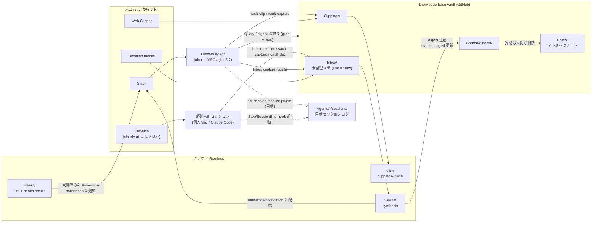

# Mnemos — Obsidian Vault 共有エージェントメモリ

> Karpathy LLM Wiki パターンを採用した、複数 AI エージェント（Claude Code / OpenCode / Hermes Agent）の **共有長期記憶** システム。`knowledge-base` Obsidian vault を substrate として、セッションを跨いで知識を積み上げる。

ギリシャ神話の記憶の女神 Mnemosyne（ムネモシュネ、ムーサの母）に由来。記憶が創造を生む構造を体現する。

---

## 1. このシステムが解決すること

LLM エージェントとの対話は通常、**毎セッションで揮発する**。Web を毎回検索し直し、過去の決定を覚えておらず、調べた内容も次回に活きない。

Mnemos は、

- セッションで得た知見・決定・調査結果を Obsidian vault に**ファイルし直す**
- 次回以降は vault を検索すればその知見が再利用できる
- 質問・調査自体が複利で積み上がっていく（compounding loop）

という運用で、これを反転させる。Karpathy の表現を借りれば「The Obsidian vault is the IDE. The LLM is the programmer. The wiki is the codebase.」。

## 2. 構成

### 全体像



### 3 層アーキテクチャ

| 層 | ディレクトリ | 役割 | 編集者 |
|---|---|---|---|
| **Layer 1: Raw sources** | `Clippings/` | Web Clipper またはエージェント経由で保存した元記事。不変・参照用 | 人間（Clipper）+ エージェント（vault-clip skill、`clipped_by: agent` 付き） |
| **Layer 2: The wiki** | `Notes/`、`Agents/`、`Shared/`(`Inbox/` は未整理メモの作業場サブレイヤ) | LLM が所有・生成・維持するアトミックノート群 | LLM 主導 |
| **Layer 3: The schema** | vault の `CLAUDE.md` + `.claude/skills/`、dotfiles の skills | ディレクトリ規約・ワークフロー定義 | 人間 |

`index.md` は Obsidian Dataview プラグインが frontmatter から自動生成するため手動メンテ不要。時系列ジャーナルは vault の git 履歴そのもの（`git log --format='%ad %s' --date=short`）。かつて `log.md` が担っていたが、マルチライターの追記でコンフリクト源になったため 2026-07-12 に廃止（§6）。

### 3 つのアクセス経路

| 経路 | 起動 | 主用ツール | 用途 |
|---|---|---|---|
| **A: vault 内** | `cd ~/src/github.com/thinceller/knowledge-base && claude` | Grep / Glob / Read / Edit / Write | **Ingest**（Clippings → Notes 化）・**Lint**（健全性診断）・git 同期 |
| **B: 外部から** | 他プロジェクトで `claude` | `enquire-mcp` の `obsidian_*` ツール | **Query**（vault 検索）・**Capture**（軽量記録）・**Session log**（セッション要約） |
| **C: リモートエージェント** | クラウド Routine / oberon の Hermes (Slack) | git + Grep/ファイル直接操作 | **Inbox capture**(どこからでも)・**Clip / Capture**(hermes-skills 版 vault-clip / vault-capture)・**Query**・Routine 実行 |

経路A は vault が CWD にある状態。標準ツールで直接編集できる。
経路B は vault が CWD 外。MCP サーバ `enquire-mcp` を経由してハイブリッド検索（BM25 + TF-IDF + 埋め込み + wikilink graph-boost）で参照する。
Dispatch は個人 Mac 上のセッションをリモート起動する仕組みであり、経路A/B がそのまま適用される(Mac 起動 + Claude アプリが必要)。

### 5 つの操作

```
Clip    : Web 記事を原文のまま Clippings/ に保存 (vault-clip skill, 経路A/B/C)
Ingest  : Clippings/ → Notes/ (research-note skill, 経路A)
Query   : vault 検索 → 出典付き回答 (vault-memory skill, 経路B / Grep, 経路C)
Capture : 知見を Notes/ や Shared/ に記録 (vault-capture skill, 経路B/C)。未整理なら Inbox/ (inbox-capture skill)
Lint    : 矛盾・stale・orphan・未ページ化概念の検出 (vault-lint skill, 経路A / weekly Routine)
```

このうち **Query で得た良い回答を Capture で wiki に戻す** のが complexity loop の核心。
セッションログは各エージェントの hook/plugin が自動記録する（§3.2）。

## 3. 使い方

### 3.1 普段の開発セッション（経路B）

`~/some-project` で開発中、過去の決定や調査内容を参照したい時。

```
ユーザー: 「Criteo 広告の単価ってどれくらいだっけ？」
   ↓
vault-memory skill が自動起動
   ↓ obsidian_search で vault 検索
   ↓ Notes/Criteo広告.md がヒット → 出典付き回答
   ↓
ユーザー: 「ありがとう。今回 React Compiler で対応する方針に決めた」
   ↓
vault-capture skill で Shared/decisions/react-compiler-adoption.md を作成
   ↓ 既存の Notes/React Compiler系ノートに [[wikilink]] で接続
```

**判断基準**: 質問が「自分のノート・決定事項・プロジェクト文脈・調査内容」に関わるなら、まず vault-memory を起動する。

### 3.2 知見を残したい時

- **使い分け**:
  - 「これ覚えておいて」「メモして」「決まったことを残したい」→ **vault-capture**
  - 「この記事クリップして」「この URL 取っておいて」（原文保存）→ **vault-clip**
  - セッション全体の要約・変更履歴・学び → **vault-session-log**
  - Web で調査して裏取りしたコンセプトページを作りたい → **research-note**（経路A、vault 内で起動）

| 種類 | スキル | 保存先 |
|---|---|---|
| Web 記事の原文保存 | vault-clip | `Clippings/<記事タイトル>.md`（翌朝の triage に乗る） |
| 汎用概念ノート | research-note または vault-capture | `Notes/<topic>.md` |
| エージェント固有の学び | vault-capture | `Agents/<agent>/learnings/<topic>.md` |
| 技術的決定事項 | vault-capture | `Shared/decisions/<topic>.md` |
| 調査結果（軽量） | vault-capture | `Shared/research/<topic>.md` |
| コードパターン | vault-capture | `Shared/patterns/<topic>.md` |
| セッション要約 | vault-session-log | `Agents/<agent>/sessions/YYYY-MM-DD_HH-MM_<desc>.md` |

#### 自動セッションログ（2026-07-06〜）

手動の vault-session-log スキルとは別に、各エージェントの停止時に**自動で**セッションログが
`Agents/<agent>/sessions/*_auto-*.md`（frontmatter `auto: true`）として記録・更新される:

| エージェント | 仕組み | タイミング |
|---|---|---|
| Claude Code | Stop / SessionEnd hook → 共用 worker | Stop はデバウンス 30 分、SessionEnd で最終更新 |
| OpenCode | plugin（`session.idle` / `server.instance.disposed`）→ 共用 worker | 同上（worker 側で共通制御） |
| Hermes | hermes plugin（`on_session_finalize`）が oberon 上で直接 vault に push | セッション期限切れ・shutdown・/new 時 |

- 共用 worker（`vault-session-log-worker`、PATH 上）は headless claude (haiku) で transcript を
  要約し、1 セッション 1 ファイルを上書き更新する。20KB 未満の小さいセッションはスキップ
- Hermes は要約なしの機械的エクスポート（Slack 会話の Markdown 化 + 秘密情報の redact）
- 手動スキルは「人間が意図的に濃いログを残したい時」用として併存する

### 3.3 vault 内で集中的に作業する時（経路A）

新規記事を Notes 化したい、links を整理したい、健全性チェックしたい時。

```bash
cd ~/src/github.com/thinceller/knowledge-base
claude
```

ここでは **enquire-mcp は使わず Grep/Glob で直接操作する** のが基本（vault 内 CLAUDE.md に明記）。利用可能なスキル:

- `research-note`: Web 調査つき本格 ingest。信頼ソース優先順位（公式 docs > Wikipedia > 個人ブログ）、Sources セクション必須、2 ソース以上の裏取り
- `vault-lint`: 6 種類の健全性チェック（矛盾・stale・orphan・未ページ化概念・不足相互参照・thin notes）
- `obsidian-git`: vault のコミット・push・obsidian-git プラグインとの協調

### 3.4 思いつきを投げる(どこからでも)

スマホ・会社 Mac・移動中など、個人 Mac のセッションがない場所からの capture:

- **Slack(主)**: Hermes に「これ Inbox に: <内容>」と送る。oberon 上の Hermes が
  `Inbox/YYYY-MM-DD-<slug>.md`(source: hermes)を作成して push する。個人 Mac 不要。
  **チャンネルではメンション必須**(`@Hermes これ Inbox に: ...`)。
  「この記事クリップして <URL>」(→ Clippings/)や「これ覚えておいて」(→ Shared/)も
  hermes-skills 版 vault-clip / vault-capture で同様に使える
- **Dispatch(副)**: claude.ai から個人 Mac のセッションをリモート起動して同様に指示
  (Mac 起動 + Claude アプリが必要)
- **Obsidian mobile(任意)**: `Inbox/` に直接書く(同じ triage に乗る)

取り出しも個人 Mac 不要:
- 週次ダイジェストは synthesis Routine が Slack の #mnemos-notification チャンネルに配信する
- 深掘り・単発の Query は Slack で Hermes に聞く(「vault に〜のメモある?」
  「今週のダイジェスト見せて」)。Grep ベースで出典付き回答が返る

### 3.5 複利ループ（compounding loop）

セッションで得た良い回答を**チャット履歴に消さず wiki に戻す**ことで、知識が雪だるま式に増える。

評価基準（vault-memory に明記、いずれか1つ満たせばファイル化）:

- **2 つ以上のソースを統合した** 回答
- **固有名詞・数字・コード ID** など再導出が面倒な事実を含む
- **将来また聞かれそう** な問い
- **非自明な繋がりを発見した** （ノート同士を新しくリンクできた）

これらに該当しない一過性の Q&A はファイルしない。判断はエージェントが自動で行う。

## 4. 自動化（Routine）

クラウドで動くスケジュールエージェント。人間がいない時間帯に vault を育てる。

### 設定済み Routine

| ID | 名前 | スケジュール | 動作 |
|---|---|---|---|
| `trig_019mwkWyhury7fyWzkG5SSZW` | vault-weekly-lint | 毎週月曜 08:00 JST | vault-lint 相当を実行 → `Shared/research/weekly-lint-<date>.md` 生成 → commit & push + Mnemos health check(Routine の実行痕跡・Inbox の raw 滞留・git 履歴の停滞を検査し、異常時のみ #mnemos-notification に通知) |
| `trig_01JX9GaBNesWQdwnc5aLwqRn` | vault-daily-clippings-triage | 毎日 07:00 JST | 直近 24h の新規 Clippings を triage → `Shared/research/clippings-triage-<YYYY-MM>.md` 追記 → commit & push |
| `trig_017htqXEN9vAxDJgcveytyDY` | vault-weekly-synthesis | 毎週日曜 08:00 JST | Inbox/ の raw メモを triage → Notes 昇格候補・今週の追加サマリ・休眠ノート再サーフェスを `Shared/digests/<YYYY>-W<ww>-digest.md` に生成 → status: triaged 更新 → commit & push → Slack コネクタで #mnemos-notification にダイジェスト配信 |

いずれも **append-only** で動作する（既存 Notes は書き換えない。synthesis のみ Inbox frontmatter の status 更新を行う）。Routine 管理は https://claude.ai/code/routines、編集は `/schedule` skill 経由。

### Routine の特徴

- クラウドで実行されるため `enquire-mcp` は使えない。代わりに git 経由でクローン → Grep/Glob/Read/Edit/Write で操作する（経路A の cloud 版）
- 失敗時の安全策: git push 失敗時は force push しない指示にしてある
- 提案は report ファイルに集約。実際の Notes/ への取り込み判断は人間が行う

### 将来追加候補（Tier 2 以降）

- 月次 stale notes refresh（90 日以上更新のない Notes を新しい Clippings の情報と照合）
- 自動 Ingest（Clippings → Notes/ を draft branch で PR 化）

## 5. ファイル配置リファレンス

### dotfiles 側

| パス | 内容 |
|---|---|
| `home-manager/programs/obsidian-vault/default.nix` | enquire-mcp サーバ定義（`programs.mcp`） |
| `home-manager/programs/claude-code/skills/vault-memory/SKILL.md` | Query + 複利ループ |
| `home-manager/programs/claude-code/skills/vault-capture/SKILL.md` | 軽量記録 |
| `home-manager/programs/claude-code/skills/vault-session-log/SKILL.md` | セッション要約記録 |
| `home-manager/programs/claude-code/skills/vault-clip/SKILL.md` | Web 記事の Clippings/ 保存（エージェント経由クリップ） |
| `home-manager/programs/claude-code/user-memory.md` | `## Obsidian Vault` セクション（経路B からの利用ルール） |
| `home-manager/programs/opencode/AGENTS.md` | 同上の OpenCode 版 |
| `configs/.config/cage/presets.yaml` | vault パスを sandbox の allow list に追加 |
| `hosts/oberon/hermes-agent.nix` | Hermes Agent(経路C)の vault 連携(machine user 鍵・instruction) |
| `home-manager/programs/claude-code/hooks/vault-session-log.sh` | Stop/SessionEnd hook(自動セッションログの入口) |
| `home-manager/programs/claude-code/scripts/vault-session-log-worker.sh` | 自動セッションログ共用 worker(haiku 要約) |
| `home-manager/programs/opencode/plugins/vault-session-log.ts` | OpenCode plugin(自動セッションログ) |
| `hosts/oberon/hermes-plugins/session-vault-export/` | Hermes plugin(セッションの vault エクスポート) |
| `hosts/oberon/hermes-skills/` | Hermes 用 vault スキル(経路C 版 vault-clip / vault-capture、`skills.external_dirs` で配置) |

### vault 側（`knowledge-base` リポジトリ）

| パス | 内容 |
|---|---|
| `CLAUDE.md` | vault スキーマ・3 層構造・経路A 運用ルール |
| `.claude/skills/research-note/SKILL.md` | Web 調査つき ingest |
| `.claude/skills/vault-lint/SKILL.md` | 健全性診断 |
| `.claude/skills/obsidian-git/SKILL.md` | git 運用 |
| `index.md` | Dataview 自動生成カタログ |
| `Notes/`, `Clippings/`, `Shared/`, `Agents/` | 3 層のデータディレクトリ |

## 6. 設計の経緯

詳細な設計判断・代替案検討・採用理由は `docs/plans/2026-06-28-obsidian-vault-agent-memory-plan.md`(初期設計)と
`docs/plans/2026-07-05-mnemos-inbox-dispatch-plan.md`(Inbox 層・リモート入口/出口)を参照。主な選択:

- **enquire-mcp 採用**: ローカルファースト・wikilink graph-boost・MCP ネイティブ・Karpathy パターン親和性
- **経路A と経路B の分離**: vault 内では標準ツール直接、外部からは MCP のみ
- **リモート入口は Dispatch/Discord ではなく Hermes (Slack)**(2026-07-05): Dispatch は個人 Mac の
  リモート起動でスリープ依存、Discord はローカル常駐が必要。VPC の Hermes は Mac 非依存で
  Slack の一行摩擦。Hermes の書き込みは「新規追加のみ・Notes/ 禁止」に制限して品質リスクを抑制
- **通知の設計原則**: 生成系 Routine の出力は「Slack (#mnemos-notification) に届く」か
  「人間のレビューに乗る」かに必ず接続する。commit されるだけのレポートは複利にならない
- **Hooks ではなく Skills 中心**（初期設計）→ **2026-07-06 に更新**: 稼働 1 週目に「書き忘れは
  運用でカバー」が機能しなかった(capture ゼロ)ため、セッションログは hook/plugin による
  自動記録に移行(§3.2「自動セッションログ」)。手動スキルは濃いログ用に併存
- **Routine は append-only から**: 既存 Notes の自動書き換えは破壊リスクが高い。判断は人間に残す
- **log.md 廃止**(2026-07-12): 追記専用ジャーナルは初期設計で「Karpathy パターンの核」としたが、
  マルチライター(自動セッションログ・Routine・Hermes・手動スキル)が異なるマシンから同一ファイル
  末尾に追記する構造のため git/stash コンフリクトが頻発。全エントリが commit と 1:1 対応しており
  git log で完全に代替できるため廃止。health check の鮮度検査も git 履歴ベースに変更

## 7. トラブルシュート

| 症状 | 確認・対処 |
|---|---|
| `obsidian_search` が見えない | personal マシンか確認（work では無効）。`claude` 再起動。`programs.mcp.enable = true` のビルドが適用されているか。**`which claude` が `~/.local/bin/claude` を返すなら native install の PATH shadow**（vault の `Agents/Claude-Code/learnings/claude-code-native-install-path-shadow.md` 参照。Chrome extension 経由で再発しうる） |
| Slack で Hermes が反応しない | チャンネルでは**メンション必須**（`@Hermes ...`）。oberon で `systemctl status hermes-agent` とジャーナル確認 |
| 自動セッションログが生成されない | darwin-rebuild 済みか（hook/worker は rebuild で有効化）。デバウンス 30 分・transcript 20KB 未満はスキップされる仕様。state は `~/.claude/vault-session-log/` |
| Claude Code Agent View TUI が崩れる | `enableMcpIntegration = true` の `--plugin-dir` wrapper が原因の可能性。フォールバック手順（`home.activation` jq マージ）に切り替え。詳細は plan の「リスクとフォールバック」 |
| Routine が失敗する | https://claude.ai/code/routines/<trigger_id> でログ確認。git push 権限と認証を確認 |
| `vault-capture` と `research-note` の使い分けが不明 | Web 調査が必要なら research-note（経路A）、不要なら vault-capture（経路B）。境界は両 skill の description に明記 |

## 8. 用語集

| 用語 | 意味 |
|---|---|
| **Mnemos** | このシステム全体の呼称 |
| **LLM Wiki パターン** | Karpathy 提唱の compounding 知識ベース運用。RAG ではなく LLM が wiki を維持する |
| **複利ループ** | Query 結果を wiki にファイルし直すことで知識が積み上がる効果 |
| **Clip / Ingest / Query / Capture / Lint** | 5 つの基本操作 |
| **Mnemos health check** | weekly-lint Routine に統合された自己監視。Routine の実行痕跡・Inbox 滞留・git 履歴の停滞を検査し異常時のみ通知 |
| **自動セッションログ** | 各エージェントの hook/plugin による `*_auto-*.md` の自動記録（§3.2） |
| **経路A / 経路B / 経路C** | vault 内起動 / 外部から MCP 経由 / リモートエージェント（クラウド Routine・Hermes） |
| **アトミックノート** | 1 ページ 1 トピックの概念ノート。`Notes/` 配下にフラットに配置 |
